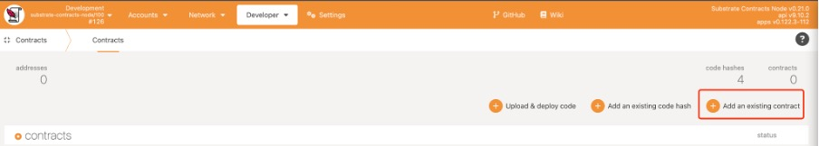
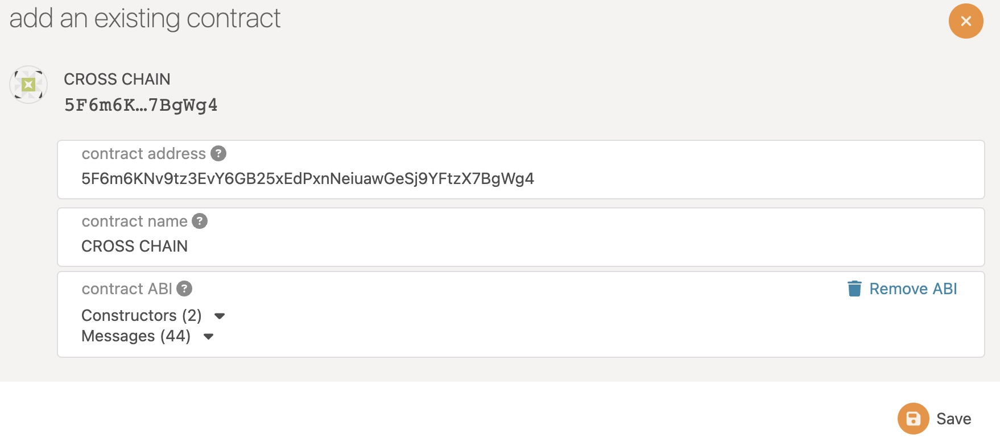
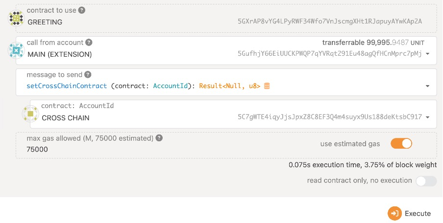
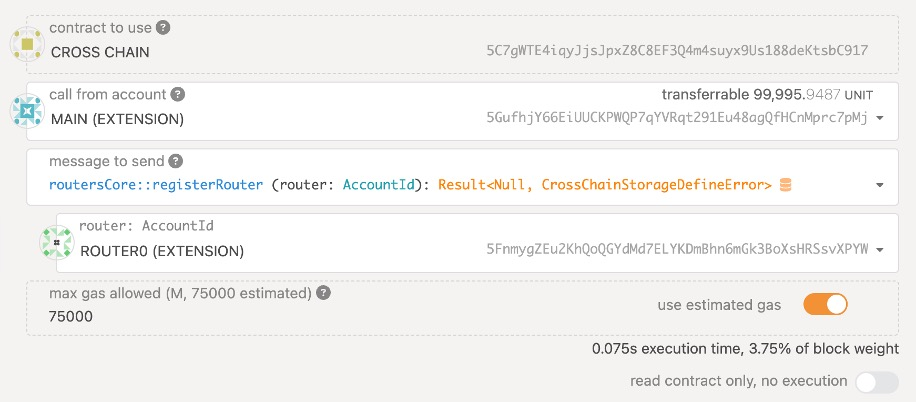
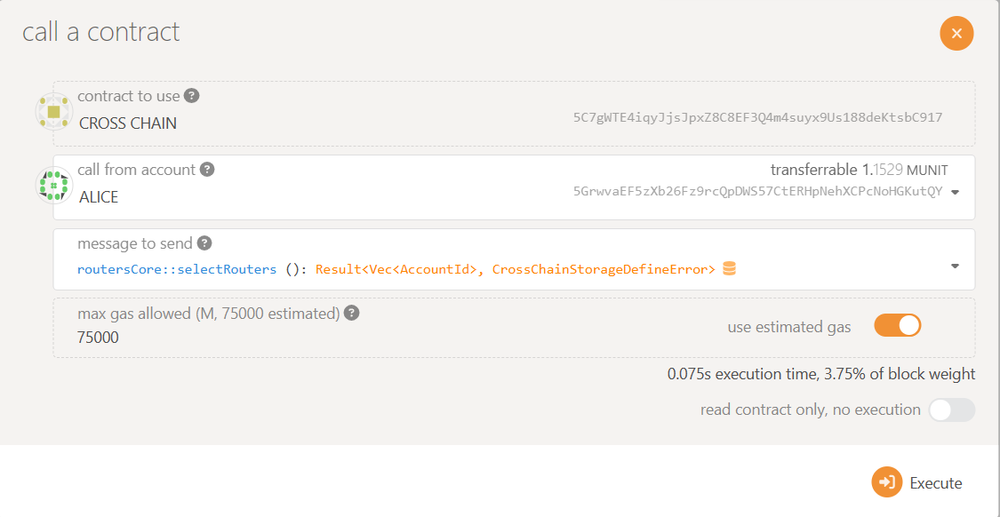
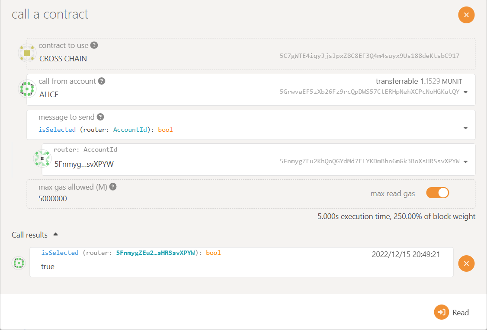

# Ink! Test Guide

This test guide is related to the features in [Milestone 2 of the grant from W3F](https://github.com/w3f/Grants-Program/blob/master/applications/Dante_Network.md#milestone-2--parallel-router-scheduling-algorithms-sqos-off-chain-routers-sdk-testnet), including the following parts:
* [Setup and Unit-Test](#setup)
* [Environment Preparing](#test-environment)
* [SQoS Item: *challenge*](./item-challenge.md)
* [SQoS Item: *hidden & reveal*](./item-hidden-reveal.md)
* [SOoS Item: *error rollback*](./item-error-rollback.md)
* [SQoS Item: *verification threshold*](./item-threshold.md)

## Prerequisites

- Rust
curl --proto '=https' --tlsv1.2 -sSf https://sh.rustup.rs | sh

- Node
NVM: curl -o- https://raw.githubusercontent.com/nvm-sh/nvm/v0.39.2/install.sh | bash
Node: `nvm install v18`

## Setup

### Install ink!
We're building this version with the dev environment of `ink! 4.0.0-alpha.3`. Use the following command to install the environment.  
```sh
$ cargo install cargo-contract --version 2.0.0-alpha.3 --locked --force
$ cargo contract --version
cargo-contract 2.0.0-alpha.3-unknown-x86_64-unknown-linux-gnu
```

### Compile contracts

Note: If compilation fails, try executing the following first

- 1.Install pkg-config
```
sudo apt install pkg-config
```

- 2.Install dylint
```
cargo install cargo-dylint, dylint-link
```

- 3.Install binaryen
    - Download
    [binaryen](https://github.com/WebAssembly/binaryen/releases/tag/version_111)
    - Uncompress
    ```
    tar -xf binaryen-version_111-x86_64-linux.tar.gz
    ```
    - Add ./bin to ENV path


#### For protocol-stack-for-ink

Clone the `feature-sqos` branch of `protocol-stack-for-ink`.

```sh
$ git clone -b feature-sqos https://github.com/dantenetwork/protocol-stack-for-ink.git
$ cd protocol-stack-for-ink/contracts/cross-chain
$ cargo contract build
$ cargo test
```

#### For ink-sdk

Clone the `feature-sqos` branch of `ink-sdk` repository. Compile the `Greeting` contract.

```sh
$ git clone -b feature-sqos https://github.com/dantenetwork/ink-sdk.git
$ cd ink-sdk/examples/greeting
$ cargo contract build
$ cargo test
```

## Test environment

We have launched a Testnet to specifically target the features in this Milestone.   

As we have not found an existing test or dev chain that supports the matched version of `ink!`, we started a test Parachain of Polkadot. The related endpoint is at: `ws://3.74.157.177:9944`

We make the test by sending message from NEAR testnet to local POLKADOT testnet. All the features need to tested are on the Polkadot side, so there's no need for us to send message or invocations from Polkadot to Near, which makes the verification more convenient.

### The deployment of all the related smart contracts

#### POLKADOT testnet contract address

* Test application contract(GREETING contract): `5D3c1Urz99B9HnWAhRREKCGvStFc4f2NNLRexoEqhKfL6EDJ`

* Dante Protocol contract(CROSS CHAIN contract): `5F6m6KNv9tz3EvY6GB25xEdPxnNeiuawGeSj9YFtzX7BgWg4`
 
* Steps:
    * Connect to `ws://3.74.157.177:9944` with `https://polkadot.js.org/apps/#/explorer`. If you met the error *`Failed to construct 'WebSocket': An insecure WebSocket connection may not be initiated from a page loaded over HTTPS.`*, just add `polkadot.js.org` to the `allowed unsafe content` of your browser.  
    * Add `GREETING` and `CROSS CHAIN` contract, use compiled metadata.json. Click `Add an existing contract` as the following picture:

    
    
    <p align="center">Add contract</p>

    * The following picture show the **test application** smart contract `GREETING`. Everything has already been prepared by us. 

    
    <p align="center">The greeting contract used to do the tests</p>

Note that MAIN(EXTENSION): `5GufhjY66EiUUCKPWQP7qYVRqt291Eu48agQfHCnMprc7pMj` is the owner of greeting and cross chain contract, which is in order to prevent others from maliciously modifying the contract.

#### NEAR testnet contract address

* Test application contract(GREETING contract): `d8ae7a513eeaa36a4c6a42127587dbf0f2adbbda06523c0fba4a16bd275089f9`

* Dante Protocol contract(CROSS CHAIN contract): `170165c66e33a744726f7f8cd36885cc43aa1e55f88273df5c6aed72e45711e6`

#### Off-chain test Routers
We have registered enough test routers

The information of the off-chain test routers for this testing is as follows: 

1 malicious router: `5D5NSmbCPZ39jzkGqez7rg548LLr6Q7h4Fp4wUcQutnUs22u`

3 honest routers:

* `5FnmygZEu2KhQoQGYdMd7ELYKDmBhn6mGk3BoXsHRSsvXPYW`

* `5FHQ7XiyuUAJp1dBgzyoGFEJkFL4um7Ge7VLgqtCkzuEsT9C`

* `5EkdEVGERnp5MabyAz92WuKYGjGa6vboarS4qQSMrCBuykB5`

#### Launch your own router
We provide a [tutorial of launching a test router](https://github.com/dantenetwork/ink-test-router), everyone can launch a test router to join.  
Currently, the **economic mechanism** is not ready, so there's no limitation for anyone to join.   
**Note that this is a temporaty mechanism and is just for the testing**.  
In the official version, **staking is needed** when registering, so as to improve the cost of some malicious behaviours.

* The way to register your own test routers is as follows:  
  

* For test, we provide a `selectRouters` function in `CROSS CHAIN` contract to re-select working routers immediately. This is just for test.   
  

* The `isSelected` function in `CROSS CHAIN` contract shows whether a router is selected currently.  
Note that `Polkadot.js.app` is not very friendly for `getter` methods, so we cannot include the *interface name* in the *screenshots*. 
  

### SQoS Items Testing
The details of SQoS Items are as follows:  
* [SQoS Item: *challenge*](./item-challenge.md)
* [SQoS Item: *hidden & reveal*](./item-hidden-reveal.md)
* [SOoS Item: *error rollback*](./item-error-rollback.md)
* [SQoS Item: *verification threshold*](./item-threshold.md)
