# Ink! Test Guide

## Setup

### Install ink!

```sh
$ cargo install cargo-contract --version 2.0.0-beta
$ cargo contract --version
cargo-contract-contract 2.0.0-beta-unknown-x86_64-unknown-linux-gnu
```

### Compile contracts

#### For protocol-stack-for-ink

Clone the `feature-sqos` branch of `protocol-stack-for-ink`.

```sh
$ git clone -b feature-sqos https://github.com/dantenetwork/protocol-stack-for-ink.git
$ cd protocol-stack-for-ink/contracts/cross-chain
$ cargo contract build
$ cargo test
```

#### For ink-sdk

Clone the `ink-sdk` repository and switch to `feature-sqos` branch. Compile the `Greeting` contract.

```sh
$ git clone -b feature-sqos https://github.com/dantenetwork/ink-sdk.git
$ cd ink-sdk/examples/greeting
$ cargo contract build
$ cargo test
```

## Test environment

POLKADOT testnet endpoint: `ws://3.74.157.177:9944`

Send message from NEAR testnet to local POLKADOT testnet

### Cross chain contract

#### NEAR testnet

Greeting contract: `d8ae7a513eeaa36a4c6a42127587dbf0f2adbbda06523c0fba4a16bd275089f9`

Cross Chain contract: `170165c66e33a744726f7f8cd36885cc43aa1e55f88273df5c6aed72e45711e6`

#### POLKADOT testnet

Greeting contract: `5GXrAP8vYG4LPyRWF34Wfo7VnJscmgXHt1RJapuyAYwKAp2A`

Cross Chain contract: `5G2E8gS2E7EkqCwVzB7bb7vTc8Nk5465uoc67ejSJxu1rbwC`
 
#### Routers account

1 malicious router: `5D5NSmbCPZ39jzkGqez7rg548LLr6Q7h4Fp4wUcQutnUs22u`

3 honest routers:

* `5FnmygZEu2KhQoQGYdMd7ELYKDmBhn6mGk3BoXsHRSsvXPYW`

* `5FHQ7XiyuUAJp1dBgzyoGFEJkFL4um7Ge7VLgqtCkzuEsT9C`

* `5EkdEVGERnp5MabyAz92WuKYGjGa6vboarS4qQSMrCBuykB5`

## Challenge SQoS

The initial credibility of all routers is 4000, as shown in Fig.1-1.

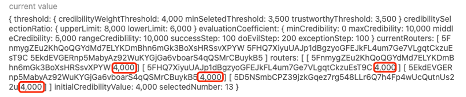
<p align="center">Fig.1-1 initial router information</p>

The challenge window period of challenge SQoS we set to 5 minutes, The value type is `u64`, it needs to be converted to milliseconds and then to bytes, finally value as shown in Fig.1-2. 

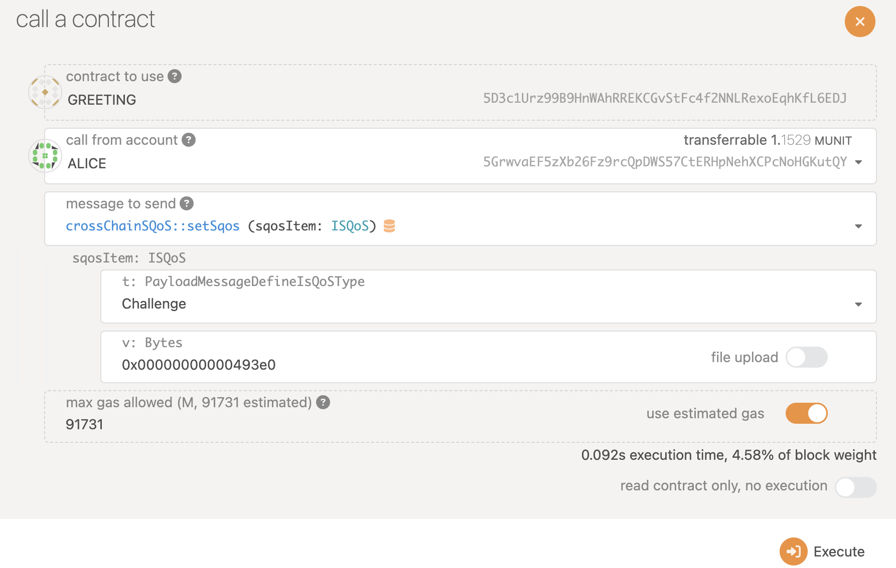
<p align="center">Fig.1-2 set challenge SQoS</p>

### For normal greeting message

Send normal greeting message from NEAR testnet

```sh
export greeting=d8ae7a513eeaa36a4c6a42127587dbf0f2adbbda06523c0fba4a16bd275089f9
​​near call $greeting send_greeting "{\"to_chain\": \"POLKADOTTEST\", \"title\": \"Greeting\", \"content\": \"Hi there\", \"date\": \"`date +'%Y-%m-%d %T'`\"}" --accountId YOU_NEAR_TEST_ACCOUNT
```

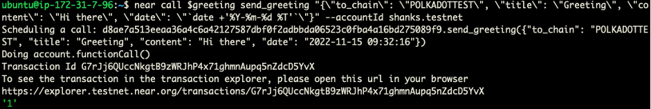
<p align="center">Fig. 1-3 send normal greeting message</p>

All honest routers push the message to the chain, and cross chain contract aggregates messages

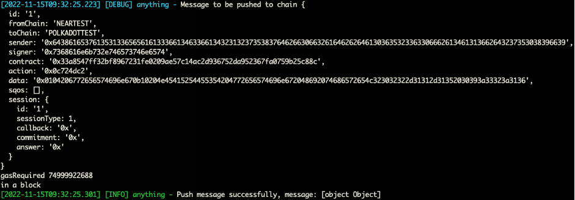
<p align="center">Fig. 1-4 router push message to cross chain</p>


<p align="center">Fig. 1-5 aggregated messages</p>

For a normal greeting message, no routers will challenge this message during the 5-minutes challenge window. When all routers received and completed the message aggregation, the message will be executed normally.


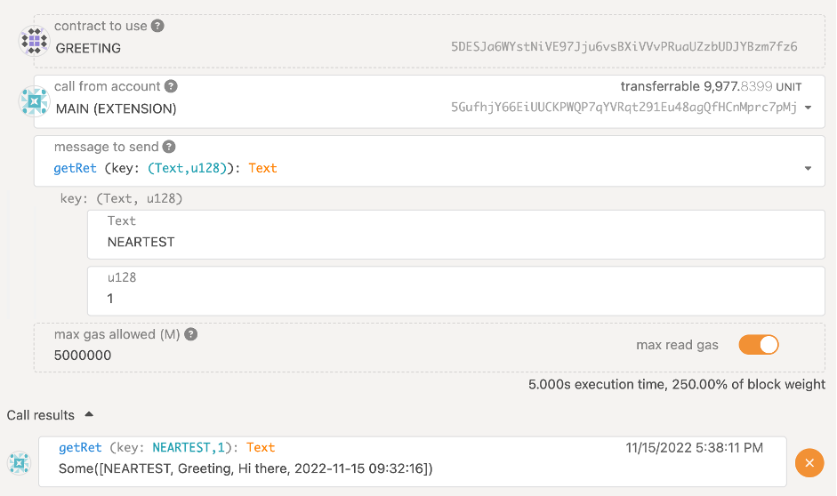
<p align="center">Fig. 1-6 the greeting message been executed after 5 minutes</p>

## For malicious message
In order to facilitate the testing of challenge SQoS, we provide an interface `submitte_fake_message` to produce a malicious message, as shown in Fig 1-7.

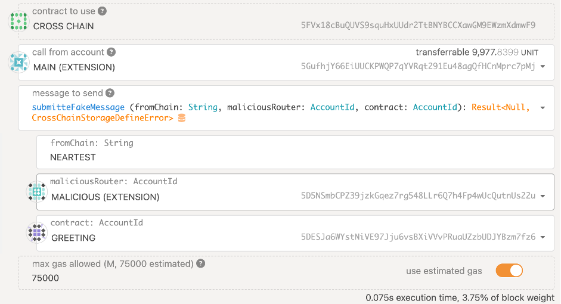
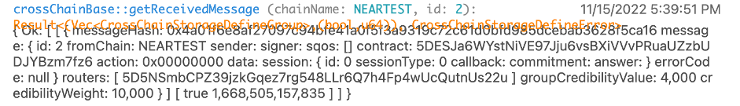
<p align="center">Fig.1-7 submitted a malicious message</p>

For all honest routers, after they detected that the source chain message is inconsistent with the destination chain message, they submit a challenge message in the destination cross chain. As shown in Fig.1-8, honest routers submitted a challenge to this malicious message.

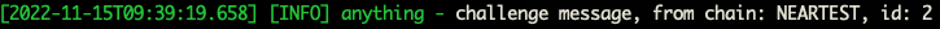
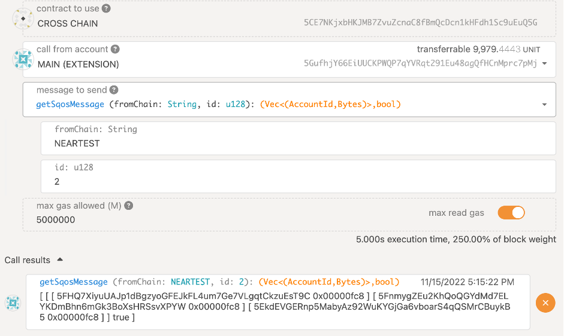
<p align="center">Fig.1-8 3 routers challenge the malicious message</p>

After the 5-minutes challenge window period is over, the router executes this message. If the challenge is successful, the cross-chain message will be abandoned and the credibility value of the malicious routers will be reduced. If the challenge is failed, the cross-chain message will be executed normally. As shown in Fig.1-9, the message challenge is successful, and the credibility value of the malicious router is reduced.

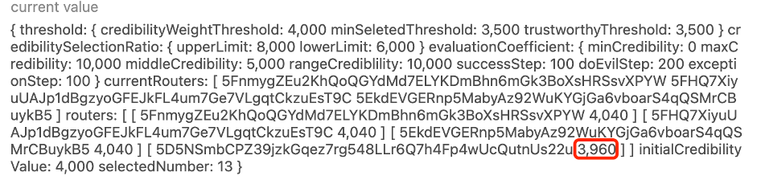
<p align="center">Fig.1-9 3 reduce the credibility of malicious router</p>

### Reveal SQoS

Change contract SQoS type as `Reveal`, no need value, as Fig.2-1 shown. `change_sqos` is only for testing.

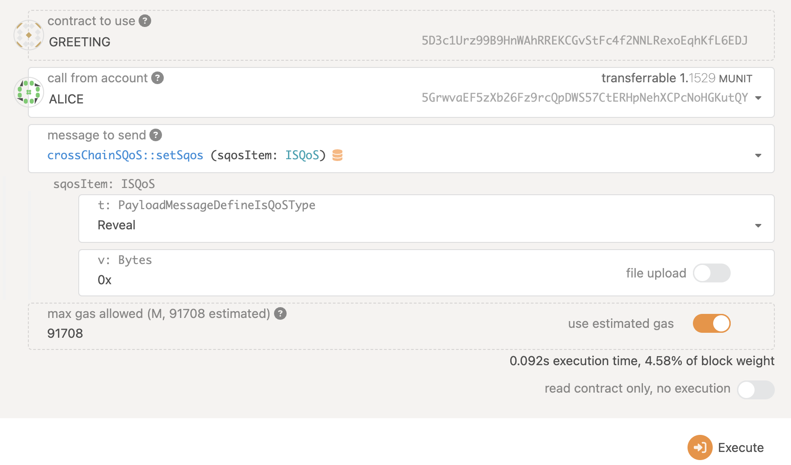
<p align="center">Fig. 2-1 set Reveal SQoS</p>

Send greeting message from NEAR testnet

```sh
export greeting=d8ae7a513eeaa36a4c6a42127587dbf0f2adbbda06523c0fba4a16bd275089f9
​​near call $greeting send_greeting "{\"to_chain\": \"POLKADOTTEST\", \"title\": \"Greeting\", \"content\": \"Hi there\", \"date\": \"`date +'%Y-%m-%d %T'`\"}" --accountId YOU_NEAR_TEST_ACCOUNT
```

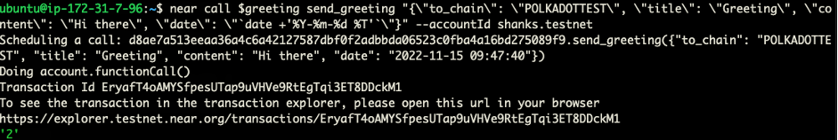
<p align="center">Fig. 2-2 send greeting</p>

All routers push hidden message to cross chain


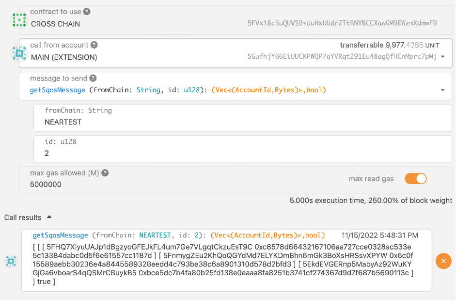
<p align="center">Fig.2-3 all routers submitted hidden message</p>

When all routers have completed submitting hidden message, they can continue to submit revealed hidden messages to prevent other routers from copying messages directly.

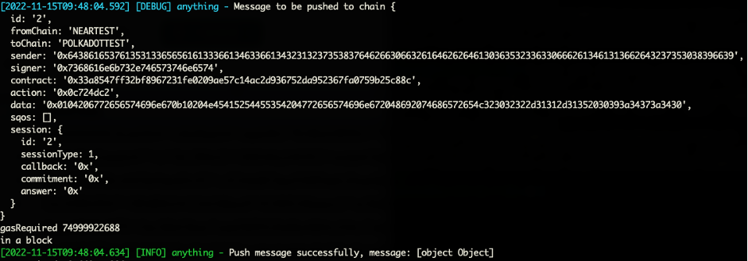
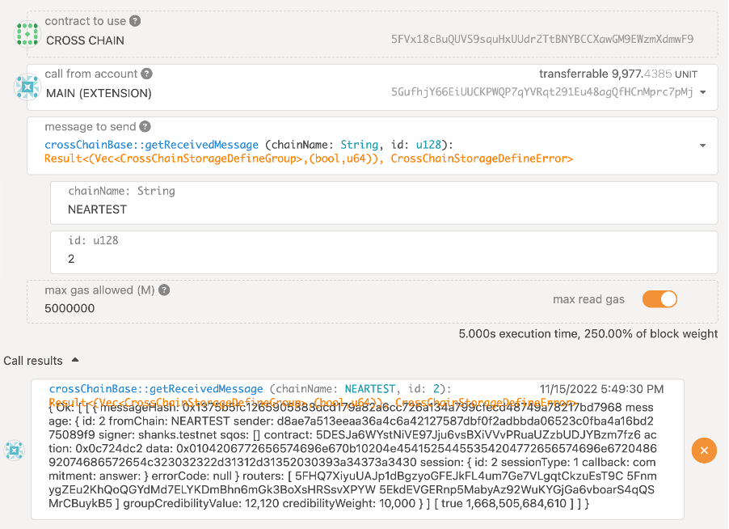
<p align="center">Fig.2-4 all routers revealed message</p>

### Verification threshold
Set contract SQoS type as `Threshold`,  the value is 80(it means only need 80% routers), the value type is `u8`,  and converted to to bytes value is `0x50` , as Fig.3-1 shown. 

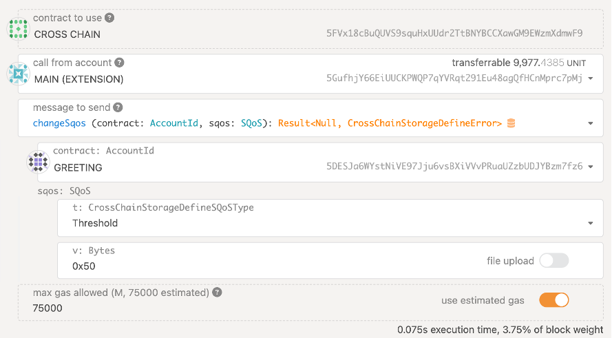
<p align="center">Fig.3-1 change to Threshold SQoS</p>

Send a greeting message from NEAR testnet.

```sh
export greeting=d8ae7a513eeaa36a4c6a42127587dbf0f2adbbda06523c0fba4a16bd275089f9
​​near call $greeting send_greeting "{\"to_chain\": \"POLKADOTTEST\", \"title\": \"Greeting\", \"content\": \"Hi there\", \"date\": \"`date +'%Y-%m-%d %T'`\"}" --accountId YOUR_NEAR_TEST_ACCOUNT
```

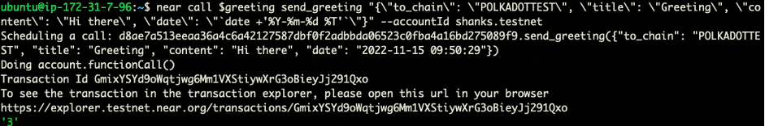
<p align="center">Fig.3-2 send a greeting message from NEAR</p>

At present, the number of routers is 3 in POLKADOT testnet, and the Threshold SQoS only needs 80% of routers to process messages, which is 2 routers to receive messages, as shown in Fig.3-3.

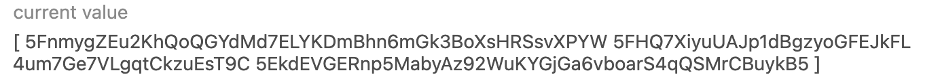
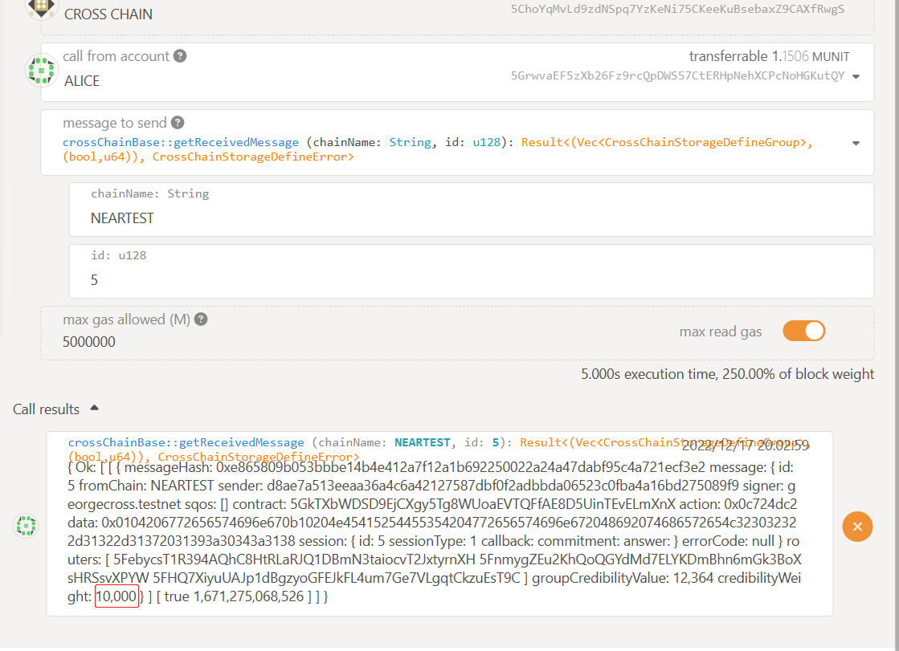
<p align="center">Fig.3-3 2 routers recevied message</p>

### Error rollback
In order to test `error rollback`, we added the `send_fake_greeting` interface in the greeting contract of NEAR testnet.

```sh
export greeting=d8ae7a513eeaa36a4c6a42127587dbf0f2adbbda06523c0fba4a16bd275089f9
​​near call $greeting send_fake_greeting "{\"to_chain\": \"POLKADOTTEST\", \"title\": \"Greeting\", \"content\": \"Hi there\", \"date\": \"`date +'%Y-%m-%d %T'`\"}" --accountId YOU_NEAR_TEST_ACCOUNT
```


<p align="center">Fig.4-1 send fake greeting message</p>

POLKADOT testnet received this fake message, and an error will be made when the cross-chain contract executes this message, and sends an error rollback to NEAR testnet, as shown in Fig.4-2 and Fig.4-3.


<p align="center">Fig.4-2 received fake greeting message</p>


<p align="center">Fig.4-3 send error rollback</p>

For NEAR testnet it will receive this error rollback, as shown Fig.4-4.

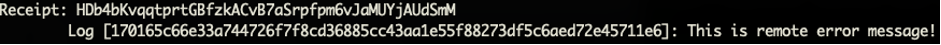

<p align="center">Fig.4-4 NEAR testnet receive error</p>
