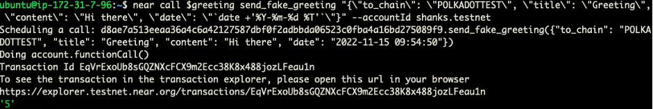
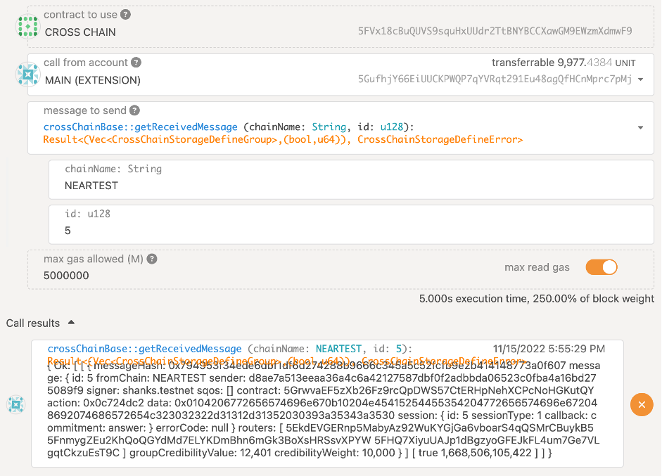
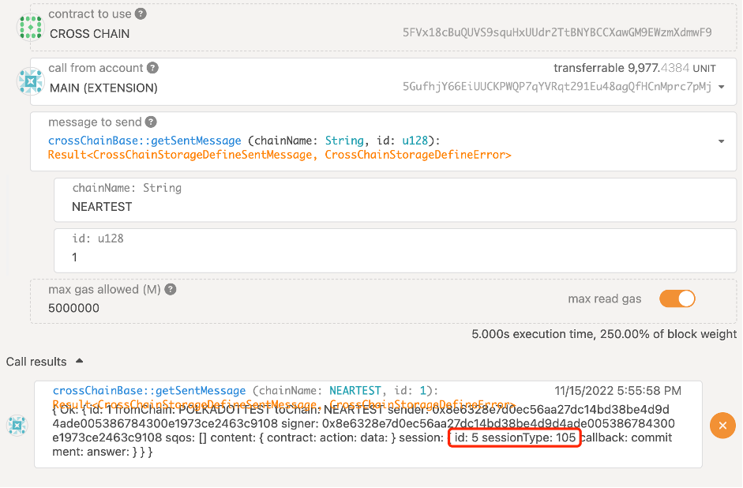
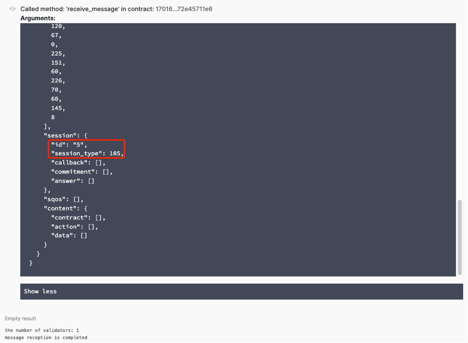

### Error rollback

**Carefully read the [Preparing Work](./README.md) first before doing the next.**  
<br>
This is a very important SQoS item that helps users know whether their remote operations are processed as wished. But an absolute “Error Rollback” is very hard to make out. Consider a situation that when an remote invocation is made from a source chain to a target chain, error happens on the target chain and a rollback reminder is sent from the target chain to the source chain, but unfortunately, the reminder is still error on the source chain, and what shall we do for the next? It is really uncomfortable to engage in an “Error Loop”.  
It seems very hard to solve this problem, but Dante did it. We borrowed the mechanism of TCP/IP three handshakes. An error won’t loop forever and the performance consumption is acceptable.  

`error rollback` is so necessary that we make it as fixed SQoS item. In order to test `error rollback`, we added the `send_fake_greeting` interface in the greeting contract of NEAR testnet.  

* Send normal greeting message from NEAR testnet. [Prepare a Near Testnet account](https://docs.near.org/concepts/basics/accounts/creating-accounts) before next.
* Export the address of contract `GREETING`, which could be found at [Preparing work](./README.md#polkadot-testnet-contract-address):  
    ```sh
    export greeting=d8ae7a513eeaa36a4c6a42127587dbf0f2adbbda06523c0fba4a16bd275089f9
    ```  

* Use your own near testnet account to send a fake greeting message to Polkadot:  
    ```sh
    near call $greeting send_fake_greeting "{\"to_chain\": \"POLKADOTTEST\", \"title\": \"Greeting\", \"content\": \"Hi there\", \"date\": \"`date +'%Y-%m-%d %T'`\"}" --accountId YOU_NEAR_TEST_ACCOUNT
    ```
* The expected result might be similar as below:   
  
<p align="center">Fig.4-1 send fake greeting message</p>

* When `CROSS CHAIN` contract on POLKADOT testnet receives this fake message, an error will be made as soon as the `CROSS CHAIN` contract executes it, and then an *`remote error information`* will be sent back to NEAR testnet, as shown in Fig.4-2 and Fig.4-3. The way to get the `id` is the same as in [item-challenge](./item-challenge.md). 
    * Received:  
    
    <p align="center">Fig.4-2 received fake greeting message</p>
    
    * Sent out:
    
    <p align="center">Fig.4-3 send error rollback</p>

* The NEAR testnet side will receive this error rollback, as shown Fig.4-4.
    * Check the receive message on `CROSS CHAIN` contract on the [Near Testnet](https://explorer.testnet.near.org/accounts/170165c66e33a744726f7f8cd36885cc43aa1e55f88273df5c6aed72e45711e6), and the result will be similar as below: 
    
    <p align="center">Fig.4-4 NEAR testnet receive remote error notificaion</p>  
    
    * `105` of the `session type` means `remote error` in Dante Protocol. More information about `session_type` can be found [here](https://github.com/dantenetwork/ink-sdk/blob/feature-sqos/README.md#other-information).  

## Links
* [Setup and Unit-Test](./README.md#setup)
* [Environment Preparing](./README.md#test-environment)
* [SQoS Item: *challenge*](./item-challenge.md)
* [SQoS Item: *hidden & reveal*](./item-hidden-reveal.md)
* [SQoS Item: *verification threshold*](./item-threshold.md)
