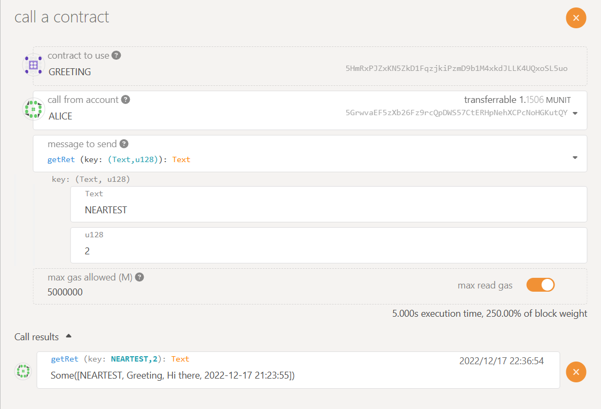

### Reveal SQoS

**Carefully read the [Preparing Work](./README.md) first before doing the next.**  
<br>
From a game theory perspective, under the strategy of majority rule, what is the best solution for an off-chain router that does not actively do evil when every submission is directly plaintext? The answer is submitting the message which is submitted by most of the other routers no matter what the truth is.  
This is the typical situation where SQoS item “Hidden & Reveal” comes into play. Before delivering the plaintext message from source chain to target chain, a cryptographic commitment would be submitted first. Commitments from every router are different from each other even if the related messages are the same. The commitment is unreadable to others. The commitment can be checked when the plaintext message is submitted. It’s very hard to construct a commitment with two different messages.  
With the help of “Hidden & Reveal”, routers that do not actively do evil will carry the true message because they cannot know what is the majority. In general, this item is used to forbid the nodes who are not bad being forced to do malicious things.   

Call `setSqos` of `GREETING` contract to set `Reveal` SQoS, no need value, as Fig.2-1 shown.


<p align="center">Fig. 2-1 set Reveal SQoS</p>

* Send normal greeting message from NEAR testnet. [Prepare a Near Testnet account](https://docs.near.org/concepts/basics/accounts/creating-accounts) before next.

* Export the address of contract `GREETING`, which could be found at [Preparing work](./README.md#polkadot-testnet-contract-address):  
    ```sh
    export greeting=d8ae7a513eeaa36a4c6a42127587dbf0f2adbbda06523c0fba4a16bd275089f9
    ```
* Use your own near testnet account to send a greeting message to Polkadot:  
    ```sh
    near call $greeting send_greeting "{\"to_chain\": \"POLKADOTTEST\", \"title\": \"Greeting\", \"content\": \"Hi there\", \"date\": \"`date +'%Y-%m-%d %T'`\"}" --accountId YOU_NEAR_TEST_ACCOUNT
    ```

* Similar result might be found as below:  

<p align="center">Fig. 2-2 send greeting</p>

* No need for any operations. All selected routers will firstly push commitments only known by themselve respectively to `CROSS CHAIN` contract on Polkadot automatically:  
***The below picture is just the record we have made, and it's printed out by test routers. For testing, there's no need to care about it because Fig.2-3 will prove the result.***


* Until now, others can only found meanless messages similar as below:  

<p align="center">Fig.2-3 all routers submitted hidden message</p>

* No need for any operations. When all selected routers have completed submitting hidden message, they can continue to submit revealed hidden messages.  
***The below picture is just the record we have made, and it's printed out by test routers. For testing, there's no need to care about it because Fig.2-4 will prove the result.***


* Check the final received message by calling `getReceivedMessage` on `CROSS CHAIN` contract on Polkadot:  

<p align="center">Fig.2-4 all routers revealed message</p>  

* Also check it by calling `getRet` on `GREETING` contract on Polkadot:  


## Links
* [Setup and Unit-Test](./README.md#setup)
* [Environment Preparing](./README.md#test-environment)
* [SQoS Item: *challenge*](./item-challenge.md)
* [SOoS Item: *error rollback*](./item-error-rollback.md)
* [SQoS Item: *verification threshold*](./item-threshold.md)
